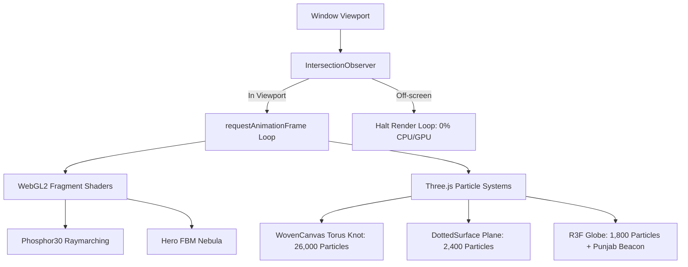
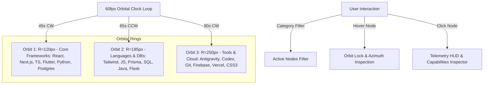
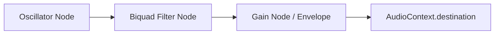

# MATRIX // Agampreet Singh Developer Portfolio

<div align="center">


<p align="center">
  <strong>A futuristic, cyberpunk-minimalist digital identity and interactive developer portfolio.</strong><br />
  Engineered with real-time WebGL2 GLSL shaders, Three.js 3D particle physics, procedural Web Audio synthesis, planetary orbital radar systems, hardware-accelerated pointer mechanics, and smooth inertial scrolling.
</p>

</div>

---

## 📑 Table of Contents

- [Overview](#-overview)
- [System Highlights & Key Features](#-system-highlights--key-features)
- [Technical Stack & Architecture](#-technical-stack--architecture)
- [Complete Project Directory](#-complete-project-directory)
- [Deep Dive: WebGL Shaders & 3D Particle Graphics](#-deep-dive-webgl-shaders--3d-particle-graphics)
- [Deep Dive: 2D/3D Orbital Radar Constellation](#-deep-dive-2d3d-orbital-radar-constellation)
- [Deep Dive: Procedural Web Audio Engine](#-deep-dive-procedural-web-audio-engine)
- [Design System & Typography](#-design-system--typography)
- [Performance & Accessibility Engineering](#-performance--accessibility-engineering)
- [Getting Started & Local Development](#-getting-started--local-development)
- [Customization Guide](#-customization-guide)
- [Author & Connect](#-author--connect)
- [License](#-license)

---

## 🌌 Overview

**MATRIX** is the personal portfolio and digital identity of **Agampreet Singh**, pursuing a dual academic path:
- **MTech FYIP Computer Science & Engineering** at Guru Nanak Dev University (GNDU Amritsar, 2024–2029)
- **BS in Data Science** at the Indian Institute of Technology Madras (IIT Madras, 2024–2028)

The portfolio is structured as a high-performance single-page Next.js App Router application built from the ground up for high visual fidelity, 60/120fps interactions, and cybernetic minimalism. Rather than relying on static images or heavy pre-rendered video backgrounds, MATRIX synthesizes dynamic visuals, ambient lighting, particle webs, and soundscapes entirely in real-time through **WebGL2 GLSL fragment shaders**, **Three.js particle meshes**, and the native browser **Web Audio API**.

---

## ⚡ System Highlights & Key Features

### 1. 🚪 Introductory Gate (`IntroLoader.tsx` & `Phosphor30.tsx`)
- Full-screen entry sequence featuring an 80-iteration ray-marched `Phosphor30` WebGL2 fractal shader on desktop, paired with a lightweight radial gradient on mobile.
- Features a synchronized 3.6-second progress line indicator.
- Locks page scroll during asset initialization and exits with a smooth cubic-bezier curtain reveal (`translate-y-full` in 1150ms).

### 2. 🌌 Nebula Hero Canvas & Hanging ID Card (`Hero.tsx` & `HangingIdCard.tsx`)
- **AnimatedShaderHero Canvas:** A custom WebGL2 canvas executing a multi-octave Fractional Brownian Motion (FBM) shader with mouse-reactive coordinates and nebula luminescence.
- **Hanging Draggable ID Card:** A physics-influenced ID badge tethered by an interactive SVG lanyard. Uses quadratic bezier curve mathematics (`Q cpX cpY endX endY`) and Framer Motion spring physics (`stiffness: 180, damping: 14`) to simulate realistic rope tension, gravity sag, and momentum upon release. Features an interactive barcode link to LinkedIn.
- **Retro-Futuristic Terminal Emulator:** An interactive command-line console overlay simulating secure system handshake protocols, displaying decoded academic records, work milestones, and engineering philosophy with authentic mechanical sound ticks and restart capabilities.

### 3. 💻 Interactive 3D Code Window & Dossier Modal (`About.tsx`)
- **3D Parallax Tilt Card:** A macOS-styled `developer.ts` code editor window with real-time character-by-character syntax-highlighted typing simulation and mouse-following 3D rotation transforms (`rotateX` / `rotateY`).
- **Academic Dossier Console:** A modal overlay providing deep dives into Agampreet's dual-degree coursework (GNDU MTech & IIT Madras BS), hackathon accomplishments (3x Winner, 1x International), and leadership tenure (Finance Head at CESS).
- **Trust Ticker Bar:** A structural trust bar emphasizing competitive programming milestones.

### 4. 🛰️ 2D/3D Orbital Radar Constellation (`TechStack.tsx` — `MATRIX_RADAR_V4`)
- **Concentric Orbital System:** 3 planetary orbital rings (Orbit 1: R=120px core frameworks; Orbit 2: R=185px languages & databases; Orbit 3: R=250px tools, AI & cloud platforms).
- **60fps Orbital Clock:** Independent orbital rotation speeds and directions (Orbit 1: 45s CW, Orbit 2: 65s CCW, Orbit 3: 90s CW).
- **Interactive Telemetry HUD:** Clickable nodes with hover lock, category filters (*All*, *Web*, *Backend*, *Mobile*, *Tools*), revolution pause/resume controls, and a detailed telemetry data pane showing azimuth angle, orbit level, architectural notes, capability tags, and brand colors.
- **18 Tracked Technologies:** React.js, Next.js, TypeScript, Flutter, Python, PostgreSQL, Tailwind CSS, JavaScript, Prisma, SQL, Java, Flask, Antigravity, Codex, Git, Firebase, Vercel, and CSS3.

### 5. 🕸️ WebGL Torus Knot Projects Showcase (`Projects.tsx` & `WovenCanvas`)
- Production and prototype catalog (Gurmat Darbar, VTAP Platform, CESS Tech Fest, Hackathon Solutions) with role definitions, live links, and tech badges.
- Backed by `WovenCanvas`: a Three.js WebGL canvas rendering a **26,000-particle Torus Knot** mesh with cursor repulsion physics, elastic spring returns, and additive blending glows.

### 6. 🎛️ 3D Perspective Experience Console (`Experience.tsx`)
- Scroll-driven 3D tilt perspective wrapper powered by Framer Motion (`ContainerScroll`).
- Features a terminal-style system database console (`SYS_DATABASE`) with tabbed organizational nodes (Gurmat Darbar, CESS GNDU, VTAP), active status indicators (`ONGOING` / `RETRIEVED`), detailed accomplishment bullet points, and skill tags.

### 7. 📊 Live GitHub Activity Sync & Contribution Matrix (`Activity.tsx`)
- Client-side integration fetching live user statistics (public repositories, stargazers count, total commits, pull requests) and recent activity logs directly from the public GitHub REST API (`api.github.com/users/Agam348`).
- Interactive 7×34 contribution matrix grid with clickable cells and sound feedback.
- Fail-soft fallback data models to ensure zero visual disruption in the event of API rate limits.
- Language distribution progress visualizer.

### 8. 📡 Perspective Contact Node & Social Dossier (`Contact.tsx`)
- Floating 3D perspective contact form with custom validation, real-time input highlights (`perspective-highlight.tsx`), and animated transmission success states.
- Cybernetic social links dossier mapping LinkedIn, Instagram, GitHub, direct Email, and Cellular channels with custom hover sound triggers.

### 9. 🌐 Reactive 3D Particle Globe (`ThreeParticleScene.tsx`)
- Interactive React Three Fiber (R3F) sphere populated by 1,800 delicate points and latitude/longitude rings.
- Automatically computes spherical trigonometry to place a pulsing beacon at Agampreet's origin: **Tarn Taran, Punjab, India** (31.4519° N, 74.9218° E).
- Rotates and scales dynamically in response to scroll progress and cursor motion.

### 10. 🎯 Hardware-Accelerated Custom Pointer (`CustomCursor.tsx`)
- Bypasses React state overhead by utilizing direct DOM manipulation inside `requestAnimationFrame` for 60/120fps responsiveness.
- Multi-state pointer system:
  - **Center Ball:** Direct point indicator.
  - **Trailing Follow-Glow:** Smooth lag interpolation backplate.
  - **Circular Halo:** Expands smoothly when hovering interactive targets.
  - **Custom Arrow:** Appears on clickable anchors and buttons.
  - **Open / Closed Grab Hands:** Dynamically toggles when interacting with draggable elements (such as the ID card).

---

## 🛠️ Technical Stack & Architecture

| Layer | Technology | Version | Purpose |
| :--- | :--- | :--- | :--- |
| **Framework** | [Next.js](https://nextjs.org/) (App Router) | `16.2.6` | React framework, SSR/SSG orchestration, asset optimization |
| **Core Runtime** | [React](https://react.dev/) & [TypeScript](https://www.typescriptlang.org/) | `19.2.4` / `5.x` | Modern reactive UI, typed schemas, and component architecture |
| **Styling** | [Tailwind CSS v4](https://tailwindcss.com/) | `^4.0.0` | Next-gen styling via `@tailwindcss/postcss` & `@theme` system |
| **Smooth Scrolling**| [Lenis](https://github.com/darkroomengineering/lenis) | `^1.3.23` | Inertial momentum smooth scrolling with cubic ease-out curves |
| **Motion & Physics**| [Framer Motion](https://www.framer.com/motion/) | `^12.40.0` | Layout animations, 3D card transforms, spring physics |
| **Animation Utils** | [GSAP](https://greensock.com/) | `^3.15.0` | High-performance animation timelines |
| **3D & Canvas** | [Three.js](https://threejs.org/) | `^0.184.0` | 3D scene graphs, particle geometries, materials, camera math |
| **React 3D** | [React Three Fiber](https://r3f.docs.pmnd.rs/) / [Drei](https://github.com/pmndrs/drei) | `^9.6.1` / `^10.7.7` | Declarative Three.js components and helpers |
| **GLSL Shaders** | WebGL2 Raw Shaders | Native | Mathematical raymarching, FBM noise, and procedural canvases |
| **Audio Engine** | Web Audio API | Native | Procedural sound synthesizer (zero static audio asset overhead) |
| **Icons** | [Lucide React](https://lucide.dev/) | `^1.16.0` | Clean, modern cybernetic iconography |
| **Typography** | `next/font/google` | Built-in | Orbitron, Space Grotesk, and Sora web fonts |

---

## 📂 Complete Project Directory

```text
matrix/
├── app/
│   ├── components/
│   │   ├── About.tsx                 # Biography, 3D code window (developer.ts), & education modal
│   │   ├── Activity.tsx              # GitHub stats, live commit feed, & contribution matrix
│   │   ├── BackgroundGrid.tsx        # Dynamic 2D particle node web & ambient spotlights
│   │   ├── Contact.tsx               # Floating perspective contact form & social dossier
│   │   ├── CustomCursor.tsx          # 60/120fps multi-state cursor & grab hand mechanics
│   │   ├── Experience.tsx            # 3D perspective career chronology console (ContainerScroll)
│   │   ├── Hero.tsx                  # Landing hero, FBM shader, draggable ID card, & terminal
│   │   ├── IntroLoader.tsx           # Full-screen entry gate with Phosphor30 WebGL shader
│   │   ├── Navbar.tsx                # Glass navigation header, scrollspy, & audio mute toggle
│   │   ├── Projects.tsx              # Projects grid backed by Three.js WovenCanvas
│   │   ├── TechStack.tsx             # 2D/3D orbital radar constellation (MATRIX_RADAR_V4) & HUD
│   │   └── ThreeParticleScene.tsx    # 3D interactive particle globe with Punjab coordinate beacon
│   ├── lib/
│   │   └── sound.ts                  # Web Audio API synthesizer (clicks, beeps, drone, glitch, EMP)
│   ├── globals.css                   # Tailwind v4 @theme, font variables, animations, cursor resets
│   ├── icon.png                      # Application favicon
│   ├── layout.tsx                    # Root HTML layout, font loaders, & metadata config
│   └── page.tsx                      # Single-page assembly, Lenis smooth scroll, & audio hooks
│
├── components/
│   └── ui/
│       ├── animated-shader-background.tsx  # Reusable ambient WebGL shader backdrop
│       ├── animated-shader-hero-demo.tsx   # Interactive playground for the hero shader
│       ├── animated-shader-hero.tsx        # Hero section WebGL FBM cloud shader canvas
│       ├── container-scroll-animation.tsx  # Framer Motion 3D perspective tilt scroll wrapper
│       ├── cybernetic-grid-shader-demo.tsx # Cyberpunk grid shader playground
│       ├── cybernetic-grid-shader.tsx      # Cyberpunk-themed raymarched grid canvas
│       ├── dotted-surface-demo.tsx         # Dotted surface playground component
│       ├── dotted-surface.tsx              # Footer Three.js undulating 3D particle plane (40x60)
│       ├── hanging-id-card.tsx             # Draggable badge with dynamic bezier lanyard physics
│       ├── liquid-glass-button.tsx         # Liquid refractive distortion canvas button
│       ├── perspective-highlight.tsx       # 3D perspective mouse tilt wrapper with distance falloff
│       ├── phosphor-30.tsx                 # Generative raymarched fractal shader for intro loader
│       ├── shader-lines-demo.tsx           # Floating wave lines playground
│       ├── shader-lines.tsx                # Floating sine wave lines canvas
│       ├── spotlight-card.tsx              # Spotlight hover card with HSL border highlight
│       ├── warp-drive-shader-demo.tsx      # Warp-speed shader playground
│       ├── warp-drive-shader.tsx           # Cosmic warp-speed starfield canvas
│       ├── web-gl-shader.tsx               # Generic base class for compiling GLSL fragment shaders
│       ├── woven-light-hero-demo.tsx       # Woven light grid demonstration canvas
│       ├── woven-light-hero.tsx            # Three.js 26,000-particle Torus Knot with cursor physics
│       └── zoom-parallax.tsx               # Scroll-driven zoom image parallax component
│
├── lib/
│   └── utils.ts                      # clsx + tailwind-merge helper (cn utility)
│
├── public/
│   ├── antigravity.png               # Antigravity IDE logo
│   ├── antigravity.svg               # Antigravity vector logo
│   ├── canva-logo.svg                # Canva vector logo
│   ├── cess_tech_fest.png            # CESS Tech Fest project asset
│   ├── codex-logo.png                # OpenAI Codex skill icon
│   ├── file.svg                      # File icon asset
│   ├── globe.svg                     # Globe vector icon
│   ├── gurmat_darbar.png             # Gurmat Darbar project asset
│   ├── hackathon_solutions.png       # Hackathon prototype asset
│   ├── next.svg                      # Next.js vector logo
│   ├── nextjs-icon.png               # Next.js icon asset
│   ├── profile.jpg                   # Agampreet Singh profile photograph
│   ├── sql-logo.png                  # SQL database skill icon
│   ├── tischtap.png                  # Tischtap project asset
│   ├── vercel.svg                    # Vercel vector logo
│   └── window.svg                    # Window vector icon
│
├── .gitignore                        # Git exclusion rules
├── AGENTS.md                         # Project development rules & guidelines
├── CLAUDE.md                         # Claude instructions reference
├── eslint.config.mjs                 # ESLint flat config extending next/core-web-vitals
├── next.config.ts                    # Next.js config (remote image domains for devicons)
├── package.json                      # Dependencies and npm script definitions
├── postcss.config.mjs                # PostCSS configuration for Tailwind CSS v4
├── tsconfig.json                     # TypeScript compiler configuration with @/* alias
└── README.md                         # Comprehensive project documentation
```

---

## 🔬 Deep Dive: WebGL Shaders & 3D Particle Graphics



### 1. Mathematical Ray-Marched Fractals (`phosphor-30.tsx`)
Rendered in raw WebGL2 during the introductory sequence, this fragment shader calculates 80 iterations of complex trigonometric space folding:
$$\vec{p}_{z} += 5.0, \quad \vec{a} = \vec{a} \cdot (\vec{a} \cdot \vec{p}) - (\vec{a} \times \vec{p})$$
The color accumulator uses hyperbolic tangent normalization (`tanh(o / 5e3)`) to achieve soft phosphor-like mathematical luminescence.

### 2. Multi-Octave FBM Cloud Nebula (`animated-shader-hero.tsx`)
A custom fragment shader utilizing Fractional Brownian Motion (FBM) layered across 5 octaves of value noise. Coordinates adapt dynamically to pointer events:
$$f(p) = \sum_{i=0}^{4} a_i \cdot \text{noise}(p \cdot 2^i \cdot \mathbf{M})$$
Where $\mathbf{M}$ is a $2 \times 2$ transformation matrix $\begin{pmatrix} 1.0 & -0.5 \\ 0.2 & 1.2 \end{pmatrix}$ creating an ethereal, organic cosmic cloud.

### 3. Particle Physics Torus Knot (`woven-light-hero.tsx`)
Contains **26,000 active particles** mapped along a Torus Knot geometry ($R=1.5, r=0.5$). Every frame, arithmetic distance calculations compute cursor repulsion forces without garbage collector pressure:
$$\vec{F}_{\text{repel}} = \frac{\vec{p} - \vec{p}_{\text{mouse}}}{\|\vec{p} - \vec{p}_{\text{mouse}}\|} \cdot (1.5 - d) \cdot 0.01$$
Particles return to their home coordinates via spring restorative vectors with a $0.95$ velocity damping factor.

### 4. Undulating Dotted Surface (`dotted-surface.tsx`)
A $40 \times 60$ Three.js particle grid (2,400 points) utilizing dynamic sine wave height displacement:
$$y(x, z, t) = \sin((x + t) \cdot 0.3) \cdot 50 + \sin((z + t) \cdot 0.5) \cdot 50$$
Features a linear color gradient interpolating from sky-blue (`#38bdf8`) to cyber-indigo (`#6366f1`) across the depth axis with ambient fog blending (`#09090b`).

### 5. Reactive 3D Globe with Coordinate Beacon (`ThreeParticleScene.tsx`)
Interactive React Three Fiber globe containing 1,800 points and latitude/longitude rings. Spherical trigonometry computes the exact position for Tarn Taran, Punjab:
$$x = R \cdot \cos(\text{lat}) \cdot \cos(\text{lon}), \quad y = R \cdot \sin(\text{lat}), \quad z = R \cdot \cos(\text{lat}) \cdot \sin(\text{lon})$$
Where $\text{lat} = 31.4519^\circ$, $\text{lon} = 74.9218^\circ$, and $R = 2.3$.

### 6. 0% CPU/GPU Idle Protection via IntersectionObserver
All active WebGL and Three.js canvases (`AnimatedShaderHero`, `WovenCanvas`, `DottedSurface`) register viewport listeners via the browser's `IntersectionObserver` API. When a canvas scrolls off-screen, its `requestAnimationFrame` render loop halts immediately, reducing GPU and CPU utilization to **0%** during page reading.

---

## 🛰️ Deep Dive: 2D/3D Orbital Radar Constellation

The skills section (`TechStack.tsx`) replaces generic marquee loops with an interactive planetary orbital radar engine (`MATRIX_RADAR_V4`):



### Orbital Math & Planetary Physics:
- Every node calculates its real-time 2D coordinates using trigonometric polar-to-cartesian projection:
$$x(t) = R \cdot \cos\left(\frac{\pi}{180} \cdot (\theta_0 + \omega \cdot t)\right), \quad y(t) = R \cdot \sin\left(\frac{\pi}{180} \cdot (\theta_0 + \omega \cdot t)\right)$$
- Planet cards maintain a constant upright transformation matrix (`translate3d`), preventing upside-down text or icon flipping during orbital revolution.
- Revolutions automatically lock upon node hover to allow seamless inspection of telemetry metadata without click-miss frustration.

---

## 🔊 Deep Dive: Procedural Web Audio Engine

MATRIX operates **with zero static audio files**. Instead, `app/lib/sound.ts` instantiates a singleton `AudioSystem` class utilizing the browser's native **Web Audio API** (`AudioContext`, `OscillatorNode`, `GainNode`, `BiquadFilterNode`) to synthesize dynamic audio in real time:



### Synthesizer Methods & Sound Profiles:
- **Ambient Drone (`startDrone` / `stopDrone`):** A $55\text{Hz}$ (Low A) sawtooth oscillator filtered through a $100\text{Hz}$ low-pass filter with a low gain ($0.08$) to establish an ambient cybernetic room hum.
- **Click Feedback (`playClick`):** A sine wave oscillator at a parameterized frequency ($800\text{Hz} - 1200\text{Hz}$) with an exponential decay envelope ($0.04 \rightarrow 0.001$ over $50\text{ms}$).
- **Status Confirmation (`playBeep`):** Sine oscillator configurable for confirmation chirps ($600\text{Hz} - 950\text{Hz}$) or error alerts ($330\text{Hz}$).
- **Cyber Glitch (`playGlitch`):** High-speed 4-step square wave sequence ($200\text{Hz} \rightarrow 1200\text{Hz} \rightarrow 800\text{Hz} \rightarrow 2000\text{Hz}$) compressed into a $120\text{ms}$ burst.
- **EMP Dispersion Wave (`playEmp`):** A $1.2\text{s}$ low-frequency sawtooth sweep descending from $440\text{Hz} \rightarrow 20\text{Hz}$ coupled with a dynamic low-pass filter sweep ($800\text{Hz} \rightarrow 30\text{Hz}$).
- **Uplink Sweep (`playUplink`):** An ascending sine wave sweep ($100\text{Hz} \rightarrow 1500\text{Hz}$) over $800\text{ms}$ indicating data submission.

> [!NOTE]
> In compliance with browser autoplay security policies, audio initializes in a muted state. It can be toggled via the navbar controls, and the ambient room hum initializes automatically upon the user's first click.

---

## 🎨 Design System & Typography

### Typography Pairing
Loaded with optimal sub-setting via `next/font/google`:
- **Display & Headings:** `Orbitron` — Geometric, high-tech sans-serif for titles, numbers, and badges.
- **Subheadings & Code:** `Space Grotesk` — Monospaced feel with organic proportions for technical labels and navigation.
- **Body & Dossier:** `Sora` — Clean, human-centric geometric font engineered for high legibility at micro sizes.

### Tailwind CSS v4 Theme System
The global palette and typography tokens are configured in `app/globals.css`:
```css
@theme {
  --font-orbitron: var(--font-orbitron);
  --font-space: var(--font-space-grotesk);
  --font-sora: var(--font-sora);
  
  --color-cyan-glow: #38bdf8;   /* Soft sky blue */
  --color-purple-glow: #818cf8; /* Soft space indigo */
  --color-cyber-green: #34d399; /* Soft cyber emerald */
}
```

---

## ⚡ Performance & Accessibility Engineering

1. **Lenis Inertial Smooth Scrolling:** Configured with a premium cubic ease-out curve (`easeOutExpo`: $1 - 2^{-10t}$). Automatically detects `(prefers-reduced-motion: reduce)`, `(pointer: coarse)`, and mobile viewports to cleanly fall back to native device scrolling.
2. **Direct DOM Pointer Calculations:** `CustomCursor.tsx` updates pointer coordinates and halo scales using direct DOM mutations via `ref.current.style.transform = translate3d(...)` inside `requestAnimationFrame`, eliminating React state re-render overhead.
3. **Responsive Mobile Fallbacks:** High-overhead WebGL canvases automatically switch to lightweight CSS radial gradients when running on mobile devices or touch screens.
4. **WebGL Lifecycle Management:** Comprehensive resource disposal handlers (`geometry.dispose()`, `material.dispose()`, `gl.deleteProgram()`, `cancelAnimationFrame()`) prevent memory leaks during page navigation or component unmounting.

---

## 🚀 Getting Started & Local Development

### Prerequisites
- **Node.js**: `v20.0.0` or higher
- **npm**: `v10.0.0` or higher (or `pnpm` / `yarn` / `bun`)

### 1. Clone the Repository
```bash
git clone https://github.com/Agam348/matrix.git
cd matrix
```

### 2. Install Dependencies
```bash
npm install
```

### 3. Launch Development Server
```bash
npm run dev
```
Open [http://localhost:3000](http://localhost:3000) in your browser to view the application with Turbopack hot module reloading.

### 4. Run Code Linter
```bash
npm run lint
```

### 5. Production Build & Preview
```bash
npm run build
npm run start
```

---

## ⚙️ Customization Guide

### Updating Personal Information
- **Hero & Identity:** Modify text, subtitles, and terminal readouts in [`app/components/Hero.tsx`](file:///c:/Users/agamp/Downloads/matrix/app/components/Hero.tsx).
- **ID Badge Photo & Barcode:** Replace [`public/profile.jpg`](file:///c:/Users/agamp/Downloads/matrix/public/profile.jpg) and edit details in [`components/ui/hanging-id-card.tsx`](file:///c:/Users/agamp/Downloads/matrix/components/ui/hanging-id-card.tsx).
- **Biography & Education:** Update the `CODE_TOKENS` and modal timeline entries in [`app/components/About.tsx`](file:///c:/Users/agamp/Downloads/matrix/app/components/About.tsx).
- **Orbital Tech Stack Nodes:** Edit the `RADAR_NODES` array in [`app/components/TechStack.tsx`](file:///c:/Users/agamp/Downloads/matrix/app/components/TechStack.tsx).
- **Projects Catalog:** Add or edit project entries in the `PROJECTS_DATA` array inside [`app/components/Projects.tsx`](file:///c:/Users/agamp/Downloads/matrix/app/components/Projects.tsx).
- **Work History:** Modify the `EXPERIENCES_DATA` array inside [`app/components/Experience.tsx`](file:///c:/Users/agamp/Downloads/matrix/app/components/Experience.tsx).
- **Social Handles:** Update social links and email endpoints in [`app/components/Contact.tsx`](file:///c:/Users/agamp/Downloads/matrix/app/components/Contact.tsx).

---

## 👤 Author & Connect

**Agampreet Singh**
- 🎓 **Education:** MTech FYIP Computer Science & Engineering (GNDU Amritsar) & BS in Data Science (IIT Madras)
- 🌐 **Portfolio:** [matrix-agam.vercel.app](https://github.com/Agam348/matrix)
- 💻 **GitHub:** [@Agam348](https://github.com/Agam348)
- 💼 **LinkedIn:** [in/Agam17](https://www.linkedin.com/in/Agam17)
- 📸 **Instagram:** [@agampreetsingh382](https://www.instagram.com/agampreetsingh382/)
- 📧 **Email:** [agampreetsingh382@gmail.com](mailto:agampreetsingh382@gmail.com)

---

## 📄 License

This project is open-source and available under the [MIT License](LICENSE).
